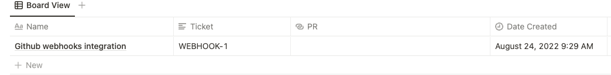

# GitHub webhook to Notion page
## Description
A simple server that allows you to update page properties
in the Notion system based on the request data received from
GitHub webhook. 

This particular server example receives _pull_request_ event and
if it contains ticket number, for corresponding page in Notion
link to PR is pasted into proper field.

## Video


## Languages
### Javascript (Node.js)
#### Dependencies
- [@notionhq/client](https://www.npmjs.com/package/@notionhq/client)
- [express](https://www.npmjs.com/package/express)

## Notion configuration
### Registering application
1. Go to [My integrations](https://www.notion.so/my-integrations) page.
2. Click _New integration_ button.
3. Check the _Insert content_ checkbox, fill rest of the form and click _Submit_.
4. Copy created access token as it is needed in application.

### Database access
Go to the page, where you want to store tickets from request. In right corner,
click _Share_ button, type name you gave to integration, click on name and then _Invite_. Now everything is
set up correctly.

### Database required fields
In your database, add two fields named _Ticket_ (_Text_ type) and _PR_ (_Link_ type) like
on the image below.


## Code configuration
Replace `NOTION_API_KEY` variable with your access key and `DATABASE_ID` with
database id you want to use. Database id can be found in the link e.g. `https://notion.so/<database_id>`.

You can also switch server port by changing `PORT` variable.

## Build & Run
To install dependencies, type in terminal
```bash
npm i
```

Then, to run script, type
```shell
node create-ticket.js
```

## How to use it (GitHub configuration)
1. In you repository go to _Settings_ -> _Webhook_ and click _Add webhook_ button.
2. Paste link to your server (remember that server address must be accesible for the world).
3. Select _Content type_ to `application/json`.
4. Check _Let me select individual events_ and select only _Pull requests_ checkbox
5. Enable _Active_ checkbox
6. Click _Add webhook_

If everything is set up correctly and server is reachable, in _Recent deliveries_ should
be succeeded `ping` event.

For every PR containing page _Ticket_ server will override this PR field in corresponding
Notion page with link.

_Contributions are welcome_
